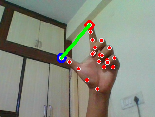

# Hand Gesture Volume Control 🎸🖐️

A fun Computer Vision project using OpenCV, MediaPipe, and PyAutoGUI to control your PC's volume—with just your hand gestures!  
Built by a music-loving coder who plays guitar and enjoys making creative tools.

***

## 🚀 Features

- **Real-time hand tracking** with your webcam.
- **Volume up/down** by changing the distance between your index finger and thumb.
- **Intuitive visual feedback**: see detected landmarks and lines between your fingers.
- Works on Windows, Mac (some features OS-dependent).

***

## 📷 Demo




## 🛠️ Technologies Used

- **Python**
- **OpenCV**
- **MediaPipe**
- **PyAutoGUI**

***

## 🏁 Getting Started

### Prerequisites

```bash
pip install -r requirements.txt
```

### Clone & Run

```bash
git clone https://github.com/akkic0des/HandGestureTracker
cd HandGestureTracker
python volume-controller.py
```

***

## 🤖 How It Works

- The program captures live webcam feed.
- Detects your hand and landmarks via MediaPipe.
- Tracks index tip (id: 8) and thumb tip (id: 4).
- Draws circles on tips, line connecting them, and calculates the distance.
- If the fingers move apart—volume goes up!  
  Move them together—volume goes down!

***

## 💡 Why?

As a computer science enthusiast and musician, I wanted to combine music and tech in a simple but creative way. Plus, it's a cool way to learn about real-world Computer Vision!

***

## 📄 License

MIT

***

## 👋 Contributing

Pull requests are welcome. Suggestions, feedback, and questions encouraged!

***

## 🙏 Credits

Inspired by online tutorials, the OpenCV and MediaPipe docs, and every coder-musician experimenting out there.

***

Enjoy controlling your music like a sci-fi movie!
